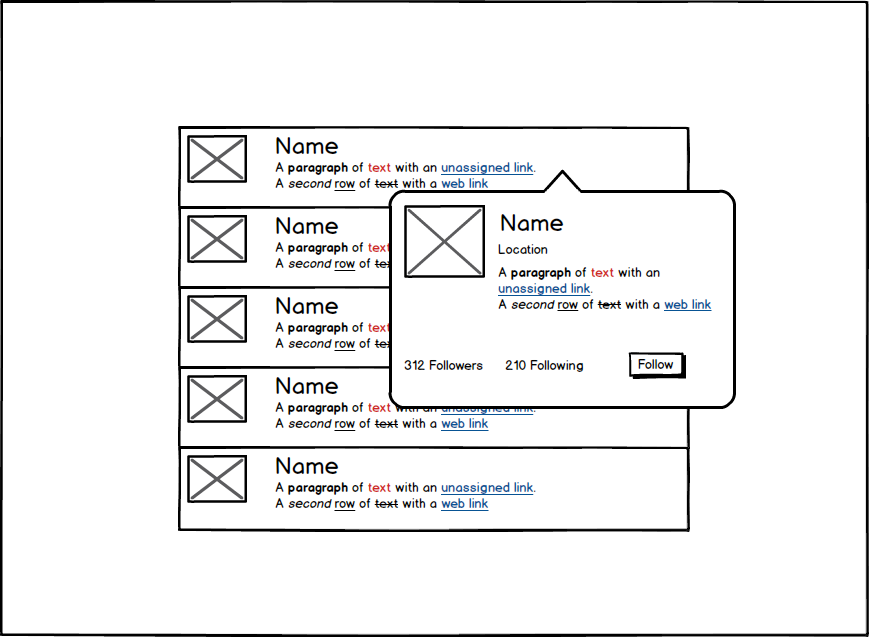

# Engineer Work Sample

Work sample to be completed to apply for the engineer position at Crowdcast.

## Context

At Crowdcast, we use a variety of technologies to serve realtime data to our users. Our core interactions happen with Firebase, but we also interact heavily with our own RESTful APIs.

The app in this repository is an Angular app served from a Node server.

To test your abilities, we've created a **very** incomplete app which has the responsibility of exposing a UI to our users for browsing a list of blogger's profiles.

We created a small service (hosted at:https://crowdcast-ws.herokuapp.com/) which provides basic user profiles. All of this is fake and modeled to work with this app. All profiles are fake.

## Setup

#### Required software & frameworks

- Node 4.x
- Angular 1.5.3

#### Starting up

The best way to work is by cloning the code to your local machine. *Do not fork the code base to a public repo* - we don't want people claiming your work as their own.

```
// only on initial setup
npm install
```

```
npm start
```
The server listens to localhost:3101 and watches any `.js, .scss` in `client/app`.
All code you write should be inside `client/app`. You can structure the subfolders however you want, though.
When adding or deleting files, you will need to restart the server.

#### Accessing stuff

Fetch user profiles from our service hosted at `https://crowdcast-ws.herokuapp.com/`

```
GET /users
returns a list of users with basic profile data
```

```
GET /users/:id
returns a single user with complete profile data
```

```
POST /follow
data: { username: usernameToFollow }
Follows a given user
```

```
DELETE /follow?username=usernameToUnfollow
Unfollows a given user
```


## What's expected of you

As a general rule, you own this app and can structure it however you want. This **could** mean reorganizing things and **probably** means adding routes, controllers, models, and specs as you feel is necessary. ES6 is strongly encouraged.

**Use the tools and libraries you enjoy using.**

### Aesthetics

Your presentation should be something you're proud of. The user-experience and aesthetic aspects should be well considered. We're not expecting an exceptionally well designed with Crowdcast's branding applied, but a generally sound user experience is.

### Feature: Display list of users

This is the landing page of your application. It should simply display a list of users along with their basic information.


### Feature: Popover to show complete user profile.

Interacting with one of the users in your list (click / hover / etc, you decide) should show a popover (modal) with more information about the user.

### Example mock


